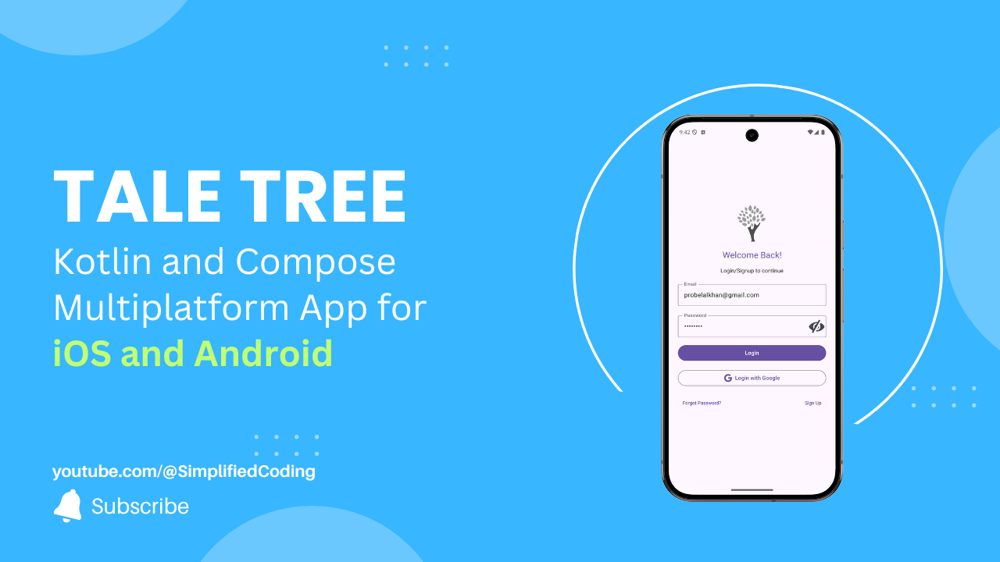

# Tale Tree KMP



A cross-platform mobile application for storytelling, built with the power of Kotlin Multiplatform. Share your stories and explore a world of tales on both Android and iOS from a single, unified codebase.

## ✨ Features

* **📱 Kotlin Multiplatform (KMP):** A single codebase for both Android and iOS, drastically reducing development time and ensuring a consistent experience across platforms.
* **🎨 Compose Multiplatform:** A modern, declarative UI framework that allows you to build beautiful, native-looking UIs for both platforms from shared code.
* **💉 Koin Dependency Injection:** A lightweight and pragmatic dependency injection framework that makes your code more modular, testable, and easier to maintain.
* **🔐 Firebase Authentication:** Securely handles user authentication, allowing users to sign up, log in, and manage their accounts with ease.
* **🌳 Modular Architecture:** The project is structured with a modular approach, promoting code reusability and separation of concerns.

## 🚀 Getting Started

To get the project up and running on your local machine, follow these steps.

### Prerequisites

* [**Android Studio**](https://developer.android.com/studio) or [**IntelliJ IDEA**](https://www.jetbrains.com/idea/)
* A machine running **macOS** with **Xcode** installed for building the iOS application.

### Setup

1.  **Clone the repository:**
    ```bash
    git clone [https://github.com/probelalkhan/taletree-kmp.git](https://github.com/probelalkhan/taletree-kmp.git)
    cd taletree-kmp
    ```

2.  **Firebase Configuration:**
    * Create a new Firebase project.
    * Enable **Email/Password** authentication in Firebase.
    * Download the `google-services.json` file for your Android app and place it in the `androidApp` directory.
    * Download the `GoogleService-Info.plist` file for your iOS app and place it in the `iosApp` directory.

3.  **Run the project:**
    * **For Android:**
      Open the project in Android Studio, sync Gradle, and run the `androidApp` configuration.

    * **For iOS:**
      Open the project in Xcode. The project will automatically link the shared KMP module. Build and run the `iosApp` target.

## 🛠️ Tech Stack

* **Language:** Kotlin
* **Multiplatform Framework:** Kotlin Multiplatform
* **UI Framework:** Compose Multiplatform
* **Dependency Injection:** Koin
* **Backend:** Firebase Authentication

## 🤝 Contributing

Contributions, issues, and feature requests are welcome! Feel free to check the [issues page](https://github.com/probelalkhan/taletree-kmp/issues).

## 📄 License

This project is licensed under the [MIT License](https://opensource.org/licenses/MIT).